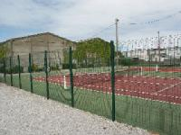
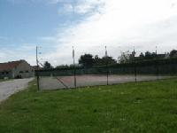

# Accès au club - Equipements

T.C. BLERIOT-PLAGE accueille les tennismen 

sur Blériot  :
- une école de Tennis, Rue Vigier 62231 BLERIOT-PLAGE

- 2 courts extérieurs.
- 2 courts couverts.
- accès par badge

sur Sangatte : Stade Porte des deux caps - Rte départementale - Sangatte

- 1 court extérieur.

 

Pour réserver votre terrain, il faut être inscrit au club. :[https://tenup.fft.fr/club/56620174](https://tenup.fft.fr/club/56620174)  