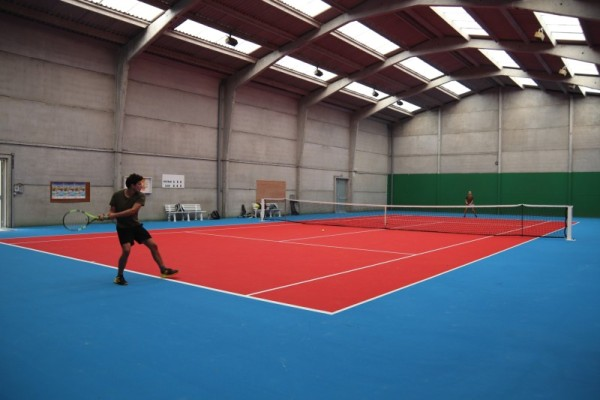
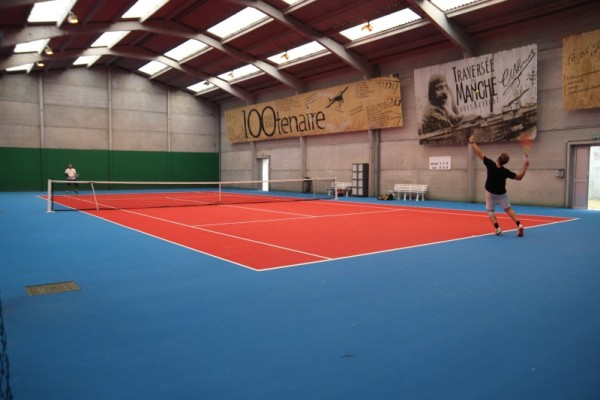
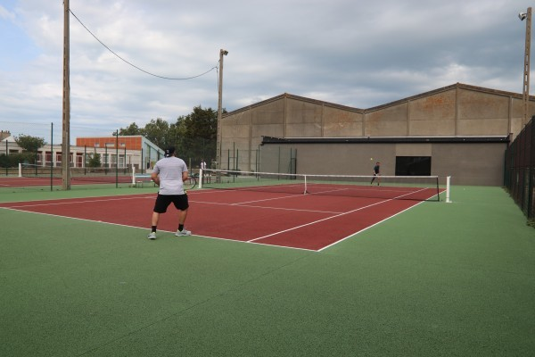
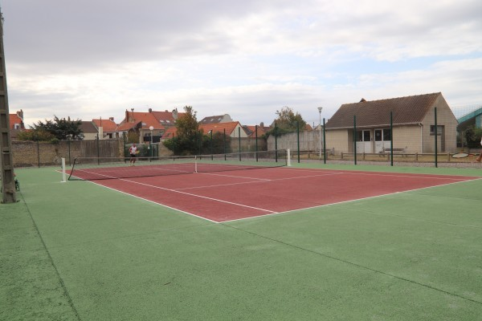

Le tennis club BTC BLERIOT-PLAGE accueille les joueurs dans une toute nouvelle infrastructure depuis 2019

** un club house depuis 2018 et tous les terrains totalement refaits en 2019 **

## à Blériot

- une école de Tennis, 19 Rue Vigier 62231 BLERIOT-PLAGE

- 2 courts extérieurs. rénovés complétement en 2019
- 2 courts couverts. rénovés complétement en 2019
- club-house, salle conviviale, wc et douches. construits en 2019
- accès par badge

 

 

## à Sangatte 

Stade Porte des deux caps - Rte départementale - Sangatte

- 1 court extérieur.

 

Pour réserver votre terrain, il faut être inscrit au club. :[tenup](https://tenup.fft.fr/club/56620174)  
