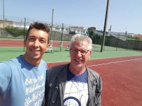

 Sylvain et Dominique, un club avec des terrains neufs, des personnes souriantes

## Direction du BTC

Président et référent COVID : Dominique HERKT

Vice Président : Eric HOAREAU

Trésorier et référent COVID : Quentin ROLAND

Secrétaire : Emilie POISSON CAILLAULT

## Comité du BTC

Dominique Herkt, Eric Hoareau, Quentin Roland, Emilie Poisson Caillault, Stéphane Clay, Vincent Degrave, Sylvain Vandebercq 

Les nouveaux bras depuis 2020 : Alexandre Vankerkove, Eric Thélu, Sébastien Deltour, Alain Charton

## Les moniteurs du BTC

Vincent Degrave - Directeur Sportif

Sylvain Vandebercq 

Didier Leclercq

Charlotte Welleme - Resp. Pôle santé

## Nos Partenaires

Mairie de Blériot-Sangatte

Grand Calais Terres & Mers

Région Hauts-de-France

Dunlop
