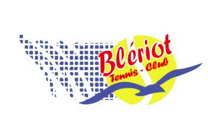

# Nous contacter

par mail : btc.bleriot@gmail.com

de visu : le samedi matin sur le site de Blériot - 19 rue Vigier 

Il est toujours possible de vous inscrire en cours d'année.

- pour vous licencier au club
- pour intégrer les cours de tennis enfant/adulte/compétition
- pour accéder aux courts/terrains toute l'année ou l'été, ou autre période délimitée.

 

Pour réserver votre cours :[Ten-up Réservation](https://mon-espace-tennis.fft.fr/club/11620174) 
