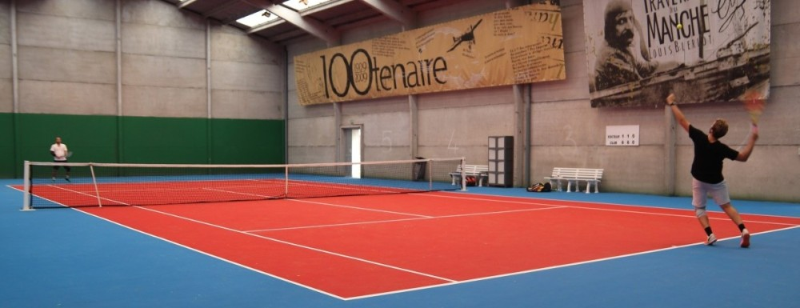

<!-- Global site tag (gtag.js) - Google Analytics -->

<!-- Google console -->
<meta name="google-site-verification" content="XZumSnzjNbmRUgdDw-UvmgAb8vNGa0UqQH4Vtfdbbys" />

 *Bienvenue au BTC* 

## News 

* 2 juin : Réouverture des courts extérieurs autorisés en simple et double sous réserve du protocole FFT. 

Attente de la mairie pour la réouverture des courts intérieurs à la Pratique Loisirs.

* Conscients de la gêne occasionnée pour les cours de tennis, un geste sera fait pour votre réinscription à l'école de Tennis.

* Saison 2020-2021: une saison aux couleurs féminines. Mesdames contactez-nous pour toute 1ère inscription au BTC un réduction de 30 euros (réduction non cumulable)

## Vous voulez jouer 

(par téléphone : +33.(0)6.82.13.53.59 ou mail btc.bleriot@gmail.com )

* Adhésion Licence découverte 3 mois entre Juin et septembre : 45 euros.  

* Location d'un court 1h pour les non adhérents : 10 euros. 

* Invitation d'un licencié extérieur au club par nos adhérents : 5 euros.

* Lien adhérent pour réserver votre court :[Application Ten-up](https://tenup.fft.fr/club/56620174) 

