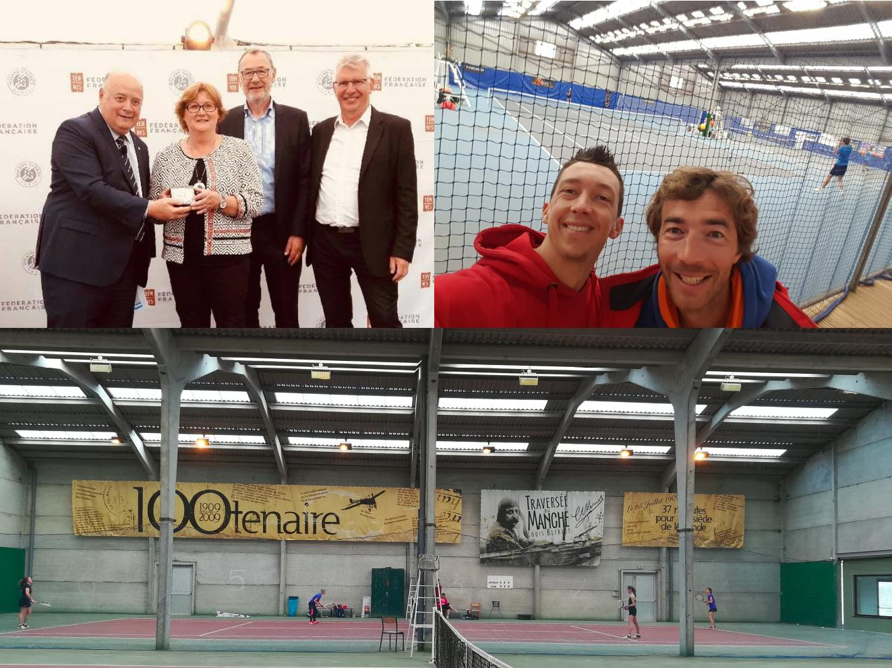

<!-- Global site tag (gtag.js) - Google Analytics -->

<!-- Google console -->
<meta name="google-site-verification" content="XZumSnzjNbmRUgdDw-UvmgAb8vNGa0UqQH4Vtfdbbys" />

Images du mois - Mai/juin 2019

# News 

*   Fête de l'école de Tennis - animations et jeux : 15 juin 2019 9h-12h  

* TOURNOI INTERNE 2019 : 18 juin au 31 aout 2019

4 euros l'inscription par catégorie (pour les lots) 
4 catégories: 

  - simple dames
  - simple messieurs
  - simple dames +35 ans
  - et simple messieurs +35 ans. 

Balles fournies par le club.

Les enfants nés à partir de 2006 peuvent y participer. 

Prise des inscriptions à partir de ce jour. 
IMPORTANT indiquer vos disponibilités : +33.(0)6.82.13.53.59 ou mail btc.bleriot@gmail.com

* Félicitations à Clémence HERKT finaliste du championnat individuel Jeunes du Pas de Calais qui s'est bien battue à Lievin. 

* Le club House et la rénovation des terrains font parler les gazettes.

[Radio 6 - 1er avril 2019](https://www.radio6.fr/article-41937-bientot-club-house-pour-club-de-tennis-de-bleriot-plage.html?fbclid=IwAR0CTdgsd6n8B9Vpc0e7Q818yqsdUSacko6qvXrivdJuIxkepmN0BMNcMNc)

[La Voix du Nord - 2 avril 2019](http://www.lavoixdunord.fr/562121/article/2019-04-02/au-club-de-tennis-bleriot-plage-un-club-house-et-des-vestiaires-livres-en-mai)

[Nord Littoral - 2 avril 2019](http://www.nordlittoral.fr/122719/article/2019-04-02/tennis-club-350-000-euros-pour-un-nouveau-club-house-et-organiser-un-1er-open)

* à noter le 1er Tournoi du BTC
  28/09/19- 03/11/19 : simple Dames, Dame+35, simple Hommes, Hommes+35 limités à 0).

# Vous voulez jouer 

(par téléphone : +33.(0)6.82.13.53.59 ou mail btc.bleriot@gmail.com )

* Adhésion Licence découverte 3 mois entre Juin et septembre : 45 euros.  

* Location d'un court 1h pour les non adhérents : 10 euros. 

* Invitation d'un licencié extérieur au club par nos adhérents : 5 euros.

* Lien adhérent pour réserver votre court :[https://tenup.fft.fr/club/56620174](https://tenup.fft.fr/club/56620174) 

