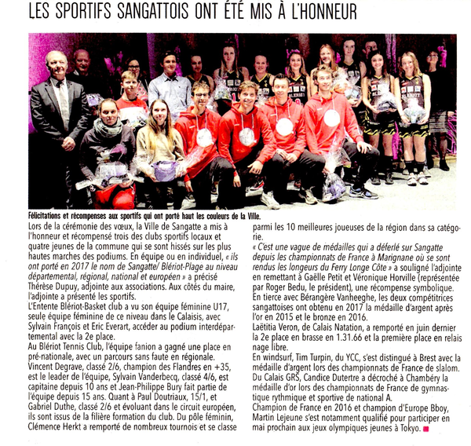

# L'évolution des joueurs formés

Dernières News : 

- L'équipe fanion masculine en pré-national
- Clémence Herkt parmi les 10 meilleures joueuses des Hauts de France.

Niveau européen :

- Paul Doutriaux classé 15/1
- Gabriel Duthe classé 2/6

Niveau régional :

- Vincent Degrave classé 2/6, Champion des Flandres 35+
- Sylvain Vanderbecq, classé 4/6
- Clémence Herkt, classée 5/6

---------------------------

Les athlètes mis à l'honneur - 21 janvier 2018!

 